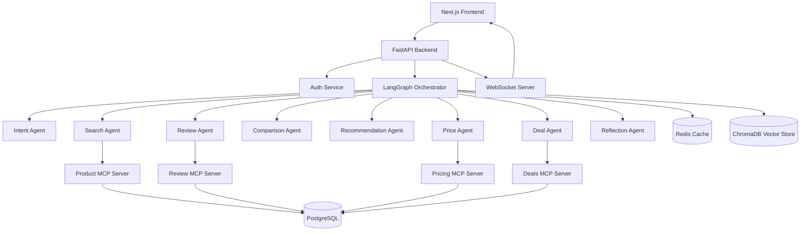
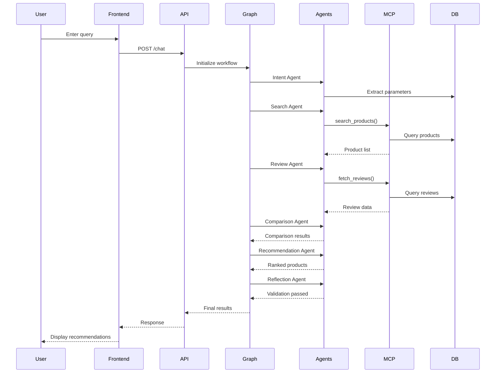
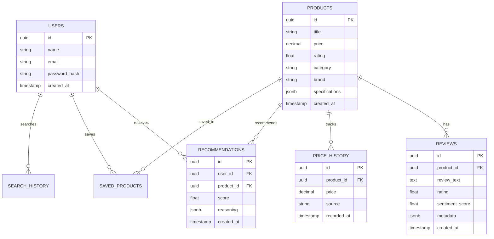

# Architecture Document

## System Overview

The AI Shopping Assistant Platform is a multi-agent system that orchestrates specialized AI agents to research products, compare alternatives, analyze reviews, and generate personalized recommendations.

## System Diagram

## Component Responsibilities

| Component | Responsibility | Technology |
|-----------|---------------|------------|
| Frontend | UI, chat interface, dashboards | Next.js, TypeScript, Tailwind |
| API Layer | Request routing, auth, validation | FastAPI, Pydantic |
| LangGraph | Agent orchestration, workflow control | LangGraph, StateGraph |
| MCP Servers | Tool exposure, data access | FastMCP, Python |
| Database | Persistent storage | PostgreSQL |
| Cache | Session data, rate limiting | Redis |
| Vector Store | Semantic search, RAG | ChromaDB |

## Critical User Flow

## Data Model Overview

## Deployment Topology

| Service | Platform | Configuration |
|---------|----------|---------------|
| Frontend | Vercel/Railway | Next.js build |
| Backend | AWS ECS/Railway | FastAPI + Uvicorn |
| PostgreSQL | AWS RLS/Supabase | Managed DB |
| Redis | AWS ElastiCache/Upstash | Managed cache |
| ChromaDB | Self-hosted | Docker container |

## External Dependencies

| Dependency | Purpose | Fallback |
|------------|---------|----------|
| OpenAI/Anthropic API | LLM inference | Rate-limited queue |
| Amazon API | Product search | Mock data |
| Flipkart API | Product search | Mock data |
| Google OAuth | Authentication | Email/password only |

## Failure Modes & Mitigations

| Failure | Impact | Mitigation |
|---------|--------|------------|
| LLM API down | Agents fail | Fallback responses, retry queue |
| MCP server timeout | Tool calls fail | Timeout + cached responses |
| Database connection lost | Data persistence fails | Connection pooling, retry logic |
| Redis unavailable | Cache miss | Direct DB queries |
| ChromaDB unavailable | RAG fails | Keyword search fallback |

## Security Considerations

1. **Authentication**: JWT with refresh tokens, Google OAuth
2. **Authorization**: Role-based access control (User, Admin)
3. **Input Validation**: Pydantic models, SQL injection prevention
4. **Rate Limiting**: Redis-backed rate limiting per user
5. **Secrets**: Environment variables, never committed
6. **CORS**: Restricted to frontend domain
7. **HTTPS**: Enforced in production

## Scalability Notes

**Current targets**: 1000 concurrent users, 10k products
**Bottlenecks at scale**: 
- LLM API rate limits → Queue system, batch processing
- Database queries → Connection pooling, read replicas
- Vector search → ChromaDB sharding, FAISS for large datasets

**Intentional simplifications**:
- Single-region deployment (can expand later)
- In-memory caching (can add distributed cache)
- Synchronous MCP calls (can add async workers)
