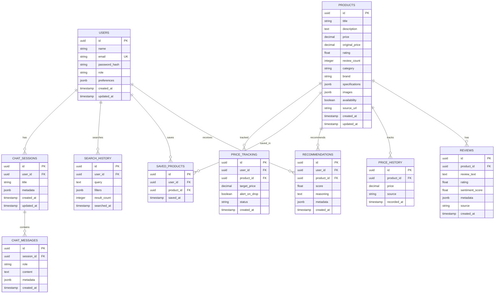

# Database Schema

## Overview

PostgreSQL database with the following tables:
- users
- products
- reviews
- recommendations
- price_history
- saved_products
- search_history
- chat_sessions
- chat_messages

## Entity Relationship Diagram



## Table Definitions

### users
Stores user accounts and preferences.

| Column | Type | Constraints | Notes |
|--------|------|-------------|-------|
| id | UUID | PK, DEFAULT gen_random_uuid() | |
| name | VARCHAR(255) | NOT NULL | |
| email | VARCHAR(255) | UNIQUE, NOT NULL | |
| password_hash | VARCHAR(255) | NOT NULL | bcrypt hash |
| role | VARCHAR(50) | DEFAULT 'user' | 'user' or 'admin' |
| preferences | JSONB | DEFAULT '{}' | Brands, categories, budget |
| created_at | TIMESTAMP | DEFAULT NOW() | |
| updated_at | TIMESTAMP | DEFAULT NOW() | |

**Indexes**:
- `idx_users_email` UNIQUE on email

### products
Stores product information from various sources.

| Column | Type | Constraints | Notes |
|--------|------|-------------|-------|
| id | UUID | PK, DEFAULT gen_random_uuid() | |
| title | VARCHAR(500) | NOT NULL | |
| description | TEXT | | |
| price | DECIMAL(10,2) | NOT NULL | Current price |
| original_price | DECIMAL(10,2) | | Price before discount |
| rating | FLOAT | | 0.0 to 5.0 |
| review_count | INTEGER | DEFAULT 0 | |
| category | VARCHAR(100) | NOT NULL | |
| brand | VARCHAR(100) | NOT NULL | |
| specifications | JSONB | DEFAULT '{}' | Technical specs |
| images | JSONB | DEFAULT '[]' | Image URLs |
| availability | BOOLEAN | DEFAULT true | |
| source_url | TEXT | | Original product URL |
| created_at | TIMESTAMP | DEFAULT NOW() | |
| updated_at | TIMESTAMP | DEFAULT NOW() | |

**Indexes**:
- `idx_products_category` on category
- `idx_products_brand` on brand
- `idx_products_price` on price
- `idx_products_rating` on rating
- `idx_products_category_brand` on (category, brand)

### reviews
Stores product reviews with sentiment analysis.

| Column | Type | Constraints | Notes |
|--------|------|-------------|-------|
| id | UUID | PK, DEFAULT gen_random_uuid() | |
| product_id | UUID | FK → products(id), NOT NULL | |
| review_text | TEXT | NOT NULL | |
| rating | FLOAT | | 1.0 to 5.0 |
| sentiment_score | FLOAT | | -1.0 to 1.0 |
| metadata | JSONB | DEFAULT '{}' | Pros, cons, helpfulness |
| source | VARCHAR(100) | | amazon, flipkart, etc. |
| created_at | TIMESTAMP | DEFAULT NOW() | |

**Indexes**:
- `idx_reviews_product_id` on product_id
- `idx_reviews_sentiment` on sentiment_score

### recommendations
Stores personalized product recommendations.

| Column | Type | Constraints | Notes |
|--------|------|-------------|-------|
| id | UUID | PK, DEFAULT gen_random_uuid() | |
| user_id | UUID | FK → users(id), NOT NULL | |
| product_id | UUID | FK → products(id), NOT NULL | |
| score | FLOAT | NOT NULL | 0.0 to 1.0 |
| reasoning | TEXT | | Why recommended |
| metadata | JSONB | DEFAULT '{}' | Category, budget, etc. |
| created_at | TIMESTAMP | DEFAULT NOW() | |

**Indexes**:
- `idx_recommendations_user_id` on user_id
- `idx_recommendations_product_id` on product_id
- `idx_recommendations_score` on score DESC

### price_history
Tracks historical prices for products.

| Column | Type | Constraints | Notes |
|--------|------|-------------|-------|
| id | UUID | PK, DEFAULT gen_random_uuid() | |
| product_id | UUID | FK → products(id), NOT NULL | |
| price | DECIMAL(10,2) | NOT NULL | |
| source | VARCHAR(100) | NOT NULL | amazon, flipkart, etc. |
| recorded_at | TIMESTAMP | DEFAULT NOW() | |

**Indexes**:
- `idx_price_history_product_id` on product_id
- `idx_price_history_recorded_at` on recorded_at DESC

### saved_products
User's saved/wishlist products.

| Column | Type | Constraints | Notes |
|--------|------|-------------|-------|
| id | UUID | PK, DEFAULT gen_random_uuid() | |
| user_id | UUID | FK → users(id), NOT NULL | |
| product_id | UUID | FK → products(id), NOT NULL | |
| saved_at | TIMESTAMP | DEFAULT NOW() | |

**Constraints**:
- UNIQUE(user_id, product_id)

**Indexes**:
- `idx_saved_products_user_id` on user_id

### search_history
Tracks user search queries.

| Column | Type | Constraints | Notes |
|--------|------|-------------|-------|
| id | UUID | PK, DEFAULT gen_random_uuid() | |
| user_id | UUID | FK → users(id), NOT NULL | |
| query | TEXT | NOT NULL | Search query |
| filters | JSONB | DEFAULT '{}' | Applied filters |
| result_count | INTEGER | | Number of results |
| searched_at | TIMESTAMP | DEFAULT NOW() | |

**Indexes**:
- `idx_search_history_user_id` on user_id

### chat_sessions
Stores chat session metadata.

| Column | Type | Constraints | Notes |
|--------|------|-------------|-------|
| id | UUID | PK, DEFAULT gen_random_uuid() | |
| user_id | UUID | FK → users(id), NOT NULL | |
| title | VARCHAR(255) | | Session title |
| metadata | JSONB | DEFAULT '{}' | |
| created_at | TIMESTAMP | DEFAULT NOW() | |
| updated_at | TIMESTAMP | DEFAULT NOW() | |

**Indexes**:
- `idx_chat_sessions_user_id` on user_id

### chat_messages
Stores individual chat messages.

| Column | Type | Constraints | Notes |
|--------|------|-------------|-------|
| id | UUID | PK, DEFAULT gen_random_uuid() | |
| session_id | UUID | FK → chat_sessions(id), NOT NULL | |
| role | VARCHAR(50) | NOT NULL | 'user' or 'assistant' |
| content | TEXT | NOT NULL | |
| metadata | JSONB | DEFAULT '{}' | Products, agents used, etc. |
| created_at | TIMESTAMP | DEFAULT NOW() | |

**Indexes**:
- `idx_chat_messages_session_id` on session_id

### price_tracking
Tracks products users want price alerts for.

| Column | Type | Constraints | Notes |
|--------|------|-------------|-------|
| id | UUID | PK, DEFAULT gen_random_uuid() | |
| user_id | UUID | FK → users(id), NOT NULL | |
| product_id | UUID | FK → products(id), NOT NULL | |
| target_price | DECIMAL(10,2) | NOT NULL | Alert when price drops below |
| alert_on_drop | BOOLEAN | DEFAULT true | |
| status | VARCHAR(50) | DEFAULT 'active' | active, triggered, paused |
| created_at | TIMESTAMP | DEFAULT NOW() | |

**Indexes**:
- `idx_price_tracking_user_id` on user_id
- `idx_price_tracking_status` on status

## Migration Strategy

1. Use Alembic for migrations
2. Each migration is versioned and reversible
3. Run `alembic upgrade head` to apply
4. Run `alembic downgrade -1` to rollback

## Seed Data

Initial seed data includes:
- Admin user account
- Sample product categories
- Sample brands
- Demo products for testing

```bash
# Run seed script
python -m backend.database.seed
```

## Performance Considerations

1. **Connection Pooling**: Use SQLAlchemy's connection pool (size=20)
2. **Read Replicas**: Add read replicas for analytics queries
3. **Partitioning**: Partition price_history by month for large datasets
4. **Archival**: Archive old chat sessions (>90 days) to cold storage
