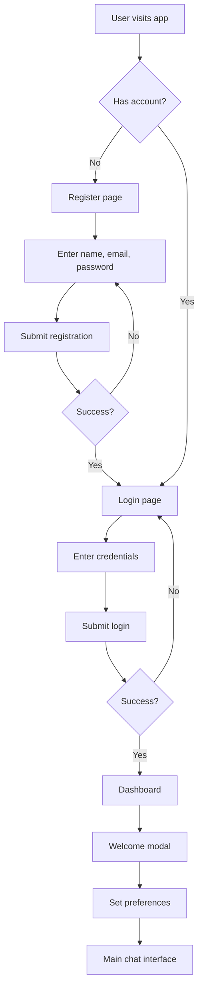
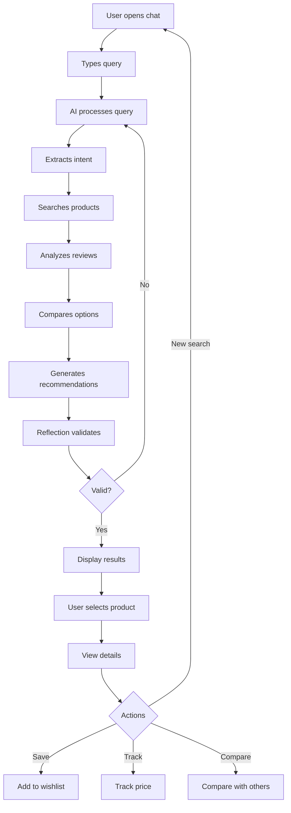
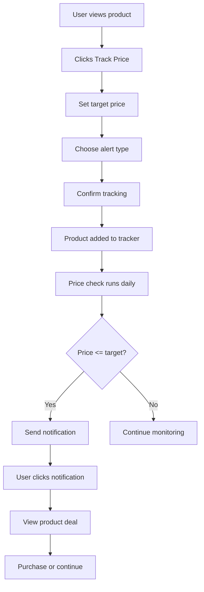
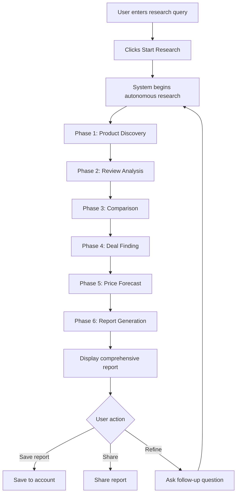
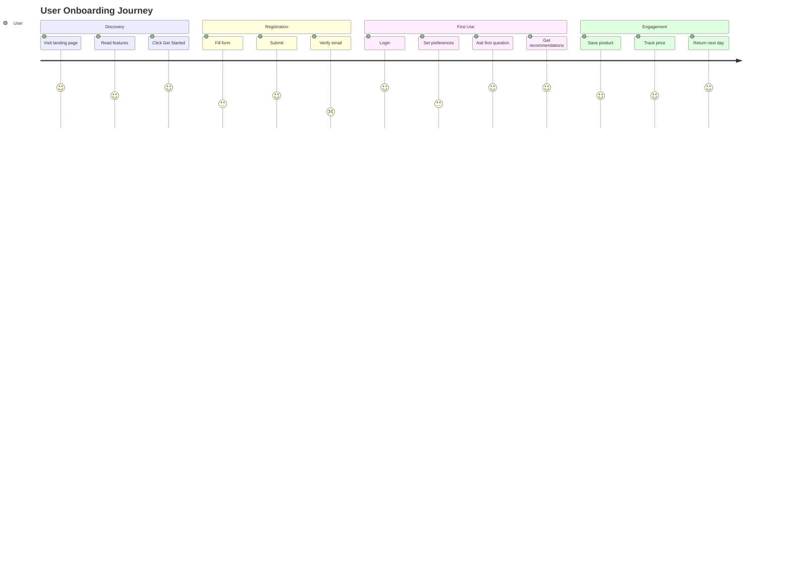

# User Flow Document

## Primary User Journeys

### Journey 1: First-Time User Onboarding

### Journey 2: Product Search & Recommendation

### Journey 3: Price Tracking Setup

### Journey 4: Autonomous Research

## Edge Cases & Error States

| Scenario | User Sees | System Action |
|----------|-----------|---------------|
| No products found | "No products match your criteria" | Suggest broadening search |
| API timeout | "Research is taking longer..." | Continue in background |
| Invalid query | "I didn't understand that" | Suggest clarifying questions |
| Price tracking error | "Unable to track price" | Log error, notify admin |
| Rate limit exceeded | "Please wait a moment" | Show countdown timer |
| Session expired | "Please log in again" | Redirect to login |
| Network error | "Connection lost" | Retry automatically |
| Product unavailable | "This product is no longer available" | Suggest alternatives |

## Onboarding Flow

## Screen Inventory

| Screen | Route | Auth | Description |
|--------|-------|------|-------------|
| Landing | `/` | No | Marketing page, features, CTA |
| Login | `/login` | No | Email/password login |
| Register | `/register` | No | New account creation |
| Dashboard | `/dashboard` | Yes | Main overview, recent activity |
| Chat | `/chat` | Yes | Conversational shopping interface |
| Chat Session | `/chat/[id]` | Yes | Specific conversation |
| Products | `/products` | Yes | Browse all products |
| Product Detail | `/products/[id]` | Yes | Single product view |
| Compare | `/compare` | Yes | Side-by-side comparison |
| Saved Products | `/saved` | Yes | User's wishlist |
| Price Tracker | `/tracker` | Yes | Price monitoring dashboard |
| Analytics | `/analytics` | Yes | User insights and trends |
| Settings | `/settings` | Yes | Account preferences |
| Admin | `/admin` | Yes (Admin) | Platform management |

## Component States

### Chat Interface
- **Empty State**: Welcome message, suggested queries
- **Loading State**: Typing indicator, "Analyzing your request..."
- **Error State**: Error message, retry button
- **Success State**: Product cards, comparison tables

### Product Cards
- **Default**: Image, title, price, rating
- **Hover**: Quick actions (save, track, compare)
- **Loading**: Skeleton placeholders
- **Error**: Retry message

### Price Tracker
- **Active**: Current price, trend graph
- **Alert Triggered**: Notification badge
- **Paused**: Muted indicator
- **No Data**: "Start tracking" prompt

## Accessibility Considerations

1. **Keyboard Navigation**: All interactive elements focusable
2. **Screen Reader**: ARIA labels on all components
3. **Color Contrast**: WCAG AA compliance
4. **Focus Indicators**: Visible focus rings
5. **Error Announcements**: Live regions for errors
6. **Skip Links**: Skip to main content
